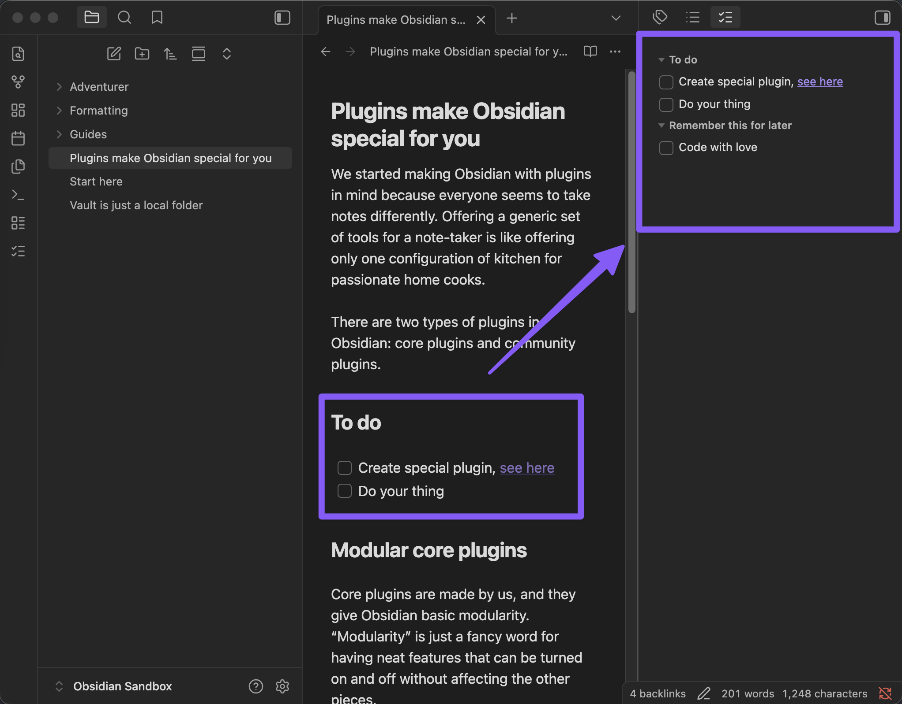

# Task Panel for Obsidian

A plugin for [Obsidian](https://obsidian.md) that adds a sidebar panel showing all tasks from your active note, grouped by heading, always in sync.

If you've got long notes with checkboxes scattered across different sections, you know the pain. Task Panel puts them all in one place, right in the sidebar for an easy overview and access.



## Features

- **Grouped by heading** - collapsible groups, same structure as the Outline view
- **Native link behavior** - `[[links]]` work like in the editor: click, hover preview, `Cmd`/`Ctrl`+click for new tab
- **Tags** - clickable `#tags` that open a global search, same as in reading view
- **Click to navigate** - click a task to jump to that line in the editor
- **Toggle completion** - check off tasks directly from the panel
- **Nested tasks** - sub-tasks render indented, keeping your hierarchy intact
- **Rich text** - bold, italic, code, strikethrough, highlights, links and tags all render with your theme's colors
- **Live updates** - refreshes on file switch, edit, rename or delete
- **Persistent layout** - remembers its position across sessions

## Settings

| Setting | Default | Description |
|---------|---------|-------------|
| Show completed tasks | On | Show completed tasks as struck-through at the bottom of each group |
| Group by heading | On | Group tasks under their parent headings, or show a flat list |

## Usage

Open the panel via:
- The **checklist icon** in the ribbon
- Command palette: **Show task panel**

## Installation

### Community plugins
Not available in the community plugin store yet.

### Manual
1. Download `main.js`, `manifest.json`, and `styles.css` from the [latest release](https://github.com/CM0NKI/obsidian-task-panel/releases/latest)
2. Create `.obsidian/plugins/task-panel/` in your vault
3. Drop the three files in there
4. Enable **Task Panel** in Settings > Community plugins

## Development

```bash
git clone https://github.com/CM0NKI/obsidian-task-panel.git
cd obsidian-task-panel
npm install
npm run dev    # watch mode
npm run build  # production build
```

## Credits

Thanks to the [Obsidian](https://obsidian.md) team for building a tool that saves my life on a daily basis.

Plugin built with [Claude Opus 4.6](https://claude.ai) by Anthropic and the [Obsidian Plugin Skill](https://github.com/gapmiss/obsidian-plugin-skill) for Claude Code.

## License

[MIT](LICENSE)
